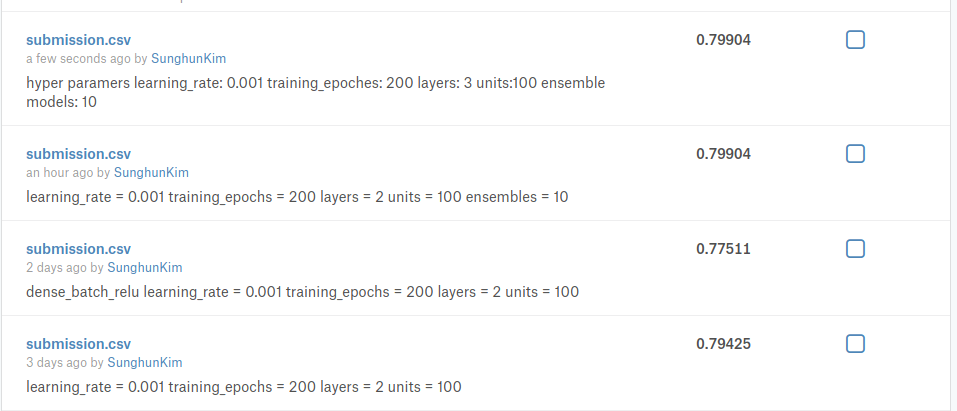

# 캐글 타이타닉 생존자 예측 

작성자: 김성헌

날짜: 2018.04.25

## 1. 데이터 분석

아래 강좌를 참조해서 분석

- [허민석님 유투브 강좌](https://www.youtube.com/watch?v=aqp_9HV58Ls)

[구현 소스](./김성헌/김성헌_타이타닉_데이터분석.ipynb) 참조.

## 2. Modeling

- tensorflow DNN ensemble model 구성
- corss validation 으로 최적 hyper parameter 탐색
- 최종 hyper parameter
  - learning_rate: 0.001
  - training_epoches: 200
  - hidden layers: 3
    - dense, dropout, relu
  - units:100
  - ensemble models: 10

[구현 소스](./김성헌/김성헌_타이타닉_DNN_Ensemble.ipynb) 참조.

## 3. 결과

